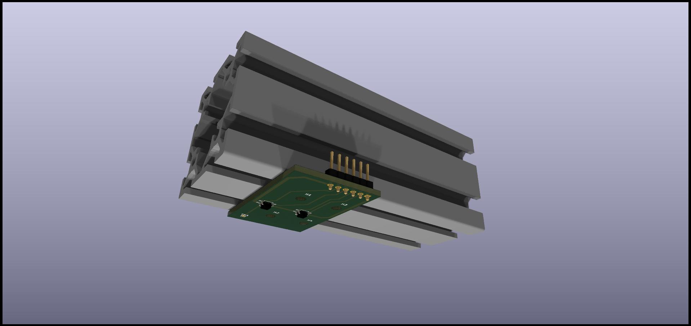

These are the KiCad files for a sensoroard containing 2 QRE1113GR (surface mount) as below

The board is asymmetric. I have done that to allow a stable mounting even if the board should be attached to the extrusion via
spacers (which are necessary if one does not fix in other ways the difference between the bass hammers and the rest -- due to the fact
that bass strings cross the other ones and hence are at a different height).

As it should be clear from the picture, this means that 2x sensorboards can **NOT** be used for the whole piano. In fact, a sensor of one side
is too distant from the side of the board to be able to fit another sensorboard nearby and still match the subsequent hammer.
These boards have been designed to be used **only** as end options for the last one or two hammers in each section, where a 4x sensorboard
would not be desirable (for example for space reasons).

At first it seems that this sensorboard can be used only on one side of the section, however if one is flexible with the connector placement
(front or back of the rail) this is not actually a limitation: a 180 degree rotation over the vertical axis will allow to this sensorboard
to be either the first or the last of each section.

Notes:

1. The 3D model of the sensor is taken from a different one and not very accurate (for example it does not show the little "dips" where
   the LED and the phototransistors are)
2. I am not sure I am allowed to include the CAD model of the aluminum extrusion, but you can download it yourself from
   [the HFS4040 page](https://us.misumi-ec.com/vona2/detail/110302684530/) on the Misumi website, and associate it to that "hole" out
   of the board

