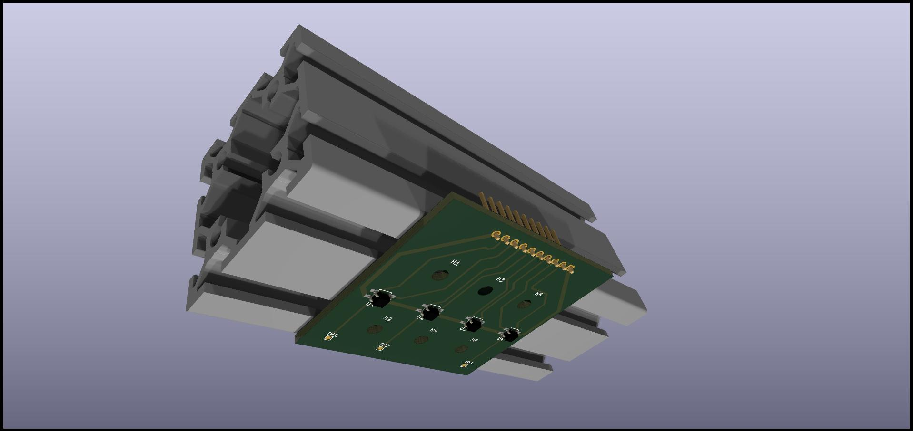

These are the KiCad files for a sensorboard containing 4 QRE1113GR (surface mount) as below

Notes:

1. The 3D model of the sensor is taken from a different one and not very accurate (for example it does not show the little "dips" where
   the LED and the phototransistors are)
2. I am not sure I am allowed to include the CAD model of the aluminum extrusion, but you can download it yourself from
   [the HFS4040 page](https://us.misumi-ec.com/vona2/detail/110302684530/) on the Misumi website, and associate it to that "hole" out
   of the board
