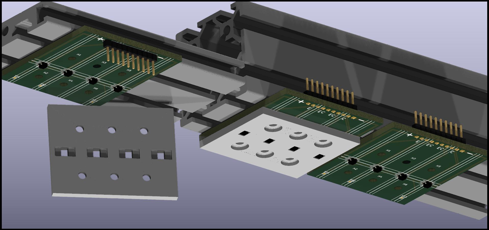

These are the KiCad files for a sensorboard containing 4 QRE1113GR (surface mount) as in the raytracing below

The image depicts an assembly of sensorboards on thick and thin rails (in dark gray, on the top).
The thick rails will be used for hammer sensors. The hammers will come from down in this picture
and the keys are "inside the screen" toward the left.

The lighter grey "sensor protector" will absorb at least part of the hammer impacts.
All the hammer boards will have those installed, but it is not shown on the board
to the right to show better the board itself. There is a levitating "sensor protector"
on the left, showing the other side with the clearance for the pins.

The board on the left, on the thinner extrusion is identical to the others. The assembly
is slightly different in that the jumper connector will be mounted on
the other side of the board. That, and the thinner extrusion make it a "key sensor" board.
It will need to be flipped upside down for the purpose, and lowered under the keys which
are not shown in this image. All keys will have them (also the keys not damped on a piano:
note off is still needed for MIDI even if it might be ignored by the virtual instrument for
the highest notes of the piano).

Note also that the 3D model of the sensor is taken from a different one and not very accurate
neither quantitatively (i.e. dimensions are incorrect) nor qualitatively (for example it does
not show the little "dips" where the LED and the phototransistors are).
The subdirectory rendering contains more information on the 3D render process

If you want to avoid the hassle of ordering, I am trying to make the whole process easier for you,
but it is not fully working yet. You can track that progress
[here](https://www.pcbway.com/project/shareproject/W341931AX1N3_gerber_54f46d6c.html)
