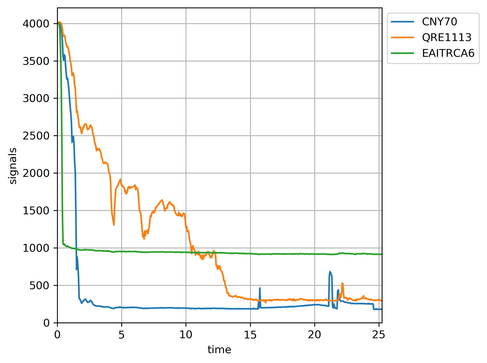
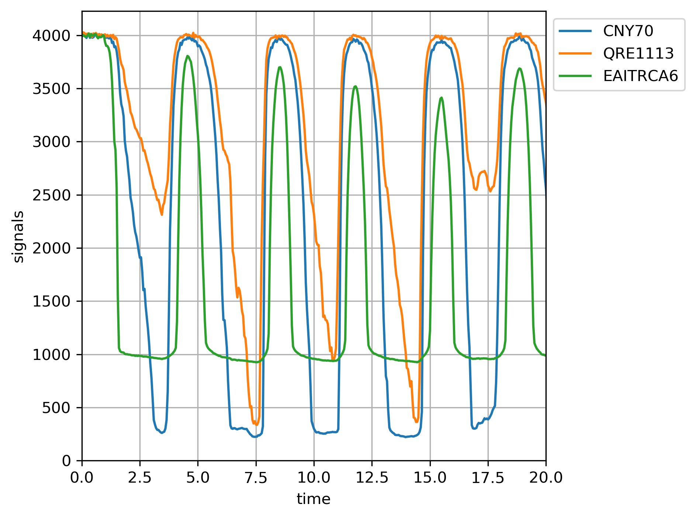
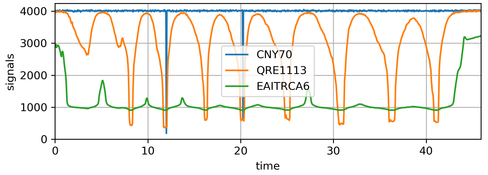

# Summary
I tested an Everligth EAITRCA6 a QRE1113 preassembled by sparkfun in the center (https://www.sparkfun.com/products/9453) and a well-known CNY70 by VISHAY on the right. The datasheet for the QRE1113 reports a response time of 20us, whereas the EAITRCA6's one depends on the load resistance (page 5 of the datasheet). The CNY70 datasheet does not mention time. The first two are quite smaller than the third, which (depending on your goals) can be a pro or a con. For me smaller is better, because:
* each sensor is more distant from the next, reducing crosstalk among neighbors
* there is more tolerance to centering each sensor on each sensed surface (hammer or keystick)
* there is less requirement on vertical space
* there is more room to place sensor protectors in front of the hammers and have them avoid slamming into the sensors themselves
* from the previous two, it is more feasible to have blinkers, further reducing crosstalk among neighbors

## Results
I did many measurements, posting here the most representative ones.
I first tested the sensors in the open, obtaining [this file](plot/no_objects.txt) with just somewhat constant value, not worth the bytes of a plot.
I then placed an object close to all, obtaining [this file](plot/close_object.txt) which is worth showing in a plot

As you can see the QRE1113 looks unclean. But hey, this is on open air with handheld object, so... let's ignore that for a moment. I oscillated the object far and close a few times, obtaining [this file](plot/oscillating_object.txt) and this plot

Again not clear results. So I tried again, obtaining this plot (sadly I've accidentally deleted the source data)

Time to put the whole thing in the piano.

# Datasheets
* EAITRCA6 https://everlightamericas.com/index.php?controller=attachment&id_attachment=1546
* QRE1113: http://cdn.sparkfun.com/datasheets/Sensors/Proximity/QRE1113.pdf and https://www.onsemi.com/pdf/datasheet/qre1113-d.pdf (same data)
* CNY70 https://www.vishay.com/docs/83751/cny70.pdf

# Capture made with Raspberry Pi Pico
* RPicoADC directory contains the software to capture analog data off 3 channels of the ADC in the RP2040, check the pico documentation for details
* Hardware setup on a breadboard as described [here](https://pianoclack.com/forum/d/243-diy-piano-sensors/36)

# Measurements
* plot directory contains the captured data and a plotting script
* large images not included in the repository, current ones are posted [here](https://pianoclack.com/forum/d/243-diy-piano-sensors/39)

