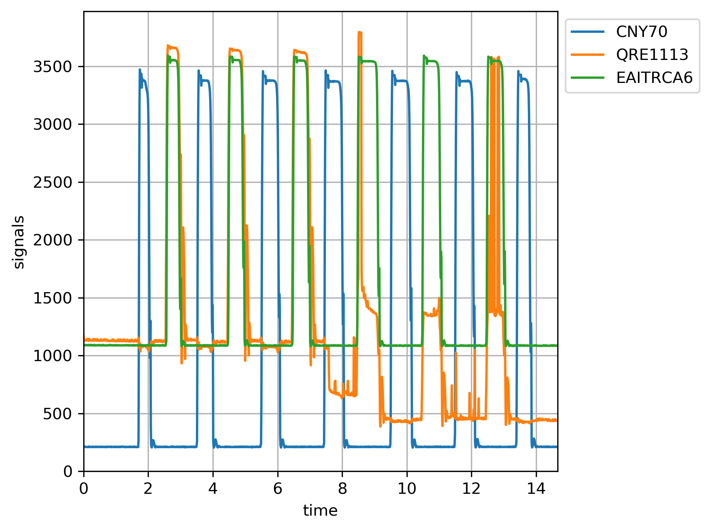
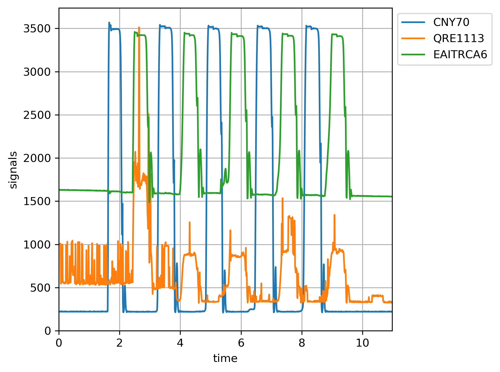

# Summary
I tested an Everligth EAITRCA6, a [QRE1113 board](https://www.sparkfun.com/products/9453) preassembled by sparkfun, and a well-known CNY70 by VISHAY. 

## Datasheets
* EAITRCA6 https://everlightamericas.com/index.php?controller=attachment&id_attachment=1546
* QRE1113: http://cdn.sparkfun.com/datasheets/Sensors/Proximity/QRE1113.pdf and https://www.onsemi.com/pdf/datasheet/qre1113-d.pdf (same data)
* CNY70 https://www.vishay.com/docs/83751/cny70.pdf

The datasheet for the QRE1113 reports a response time of 20us, whereas the EAITRCA6's one depends on the load resistance (page 5 of the datasheet), but same order of magnituted. The CNY70 datasheet does not mention response time. 

The EAITRCA6 and the QRE1113 are quite smaller than the CNY70, which (depending on your goals) can be a pro or a con. For me smaller is better, because:
* each sensor is more distant from the next, reducing crosstalk among neighbors
* there is more tolerance to centering each sensor on each sensed surface (hammer or keystick)
* there is less requirement on vertical space
* there is more room to place sensor protectors in between the hammers and the sensors, with just tiny apertures and avoiding the hammers slamming into the sensors themselves (which might not be a big deal, but still)
* from the previous two, it is more feasible to have blinkers, further reducing crosstalk among neighbors

## Results
I did many measurements, posting here the most representative ones.
I first tested the sensors in the open, obtaining [this file](plot/no_objects.txt) with just somewhat constant value, not worth the bytes of a plot.
I then placed an object close to all, obtaining [this file](plot/close_object.txt) which is worth showing in a plot

As you can see the QRE1113 data looks unclean. But hey, this is on open air with handheld object, so... let's ignore that for a moment. I oscillated the object far and close a few times, obtaining [this file](plot/oscillating_object.txt) and this plot

Again not clean results from the QRE1113. So I tried again, obtaining this plot (sadly I've accidentally deleted the source data)

In this case the QRE1113 looked the best data. The CNY70 simply became loose (its terminals are too short to be used in a breadboard). Not sure what happened to the EAITRCA6, perhaps the reflection was too much off axis? I can't tell, but it always behaved correctly in all the other many tests I ran.

I then placed the whole thing in the piano, under the back of the keys. Pressing the key moves away the back of the key from the sensor and hence is shown as low value in these plots. 
First, I arranged the board in such a way that both the QRE1113 and the EAITRCA6 where under the same key, and obtained [this data](plot/same_key.txt) and its corresponding plot

In this case both sensors where close to the edge of the key (on opposite sides obviously). The CNY70 was under a different key, which I alternatively pressed as it can be seen. Usual QRE1113 does not provide clean data results.

Next, I centered the QRE1113 under the keystick to see if in a more production-like setting it would provide cleaner data. [Here](plot/QRE_centered.txt) is what I measured and its plot:

The EAITRCA6 was on an adjacent key, which I pressed with the same finger (I think it was a B and a C). The CNY70 was on another key (I think it was a C#) which I pressed in an alternating pattern, as it can clearly be seen.
Do you start to see a pattern? Actually this is so bad that I started suspecting the item was damaged. So I disassembed the board, tried to make other measurements and accidentally powered the QRE board in reverse (swapping V_CC and ground). After that incindent it behaved even worse, so that stopped my comparisons.

## Capture made with Raspberry Pi Pico
* RPicoADC directory contains the software to capture analog data off 3 channels of the ADC in the RP2040, check the pico documentation for details
* Hardware setup on a breadboard as described [here](https://pianoclack.com/forum/d/243-diy-piano-sensors/36)

## Measurements
* plot directory contains the captured data and a plotting script
* large images not included in the repository, current ones are posted [here](https://pianoclack.com/forum/d/243-diy-piano-sensors/39)

# Conclusions
Either the CNY70 or the EAITRCA6 appear to be fine choices for this project. The former provides a little wider levels between "close" and "distance", so that may be preferable with less accurate electronics, but IMHO the EAITRCA6 is more than adequate. The QRE1113 would require further investigation, to see if my unit was defective before buying hundreds of them
